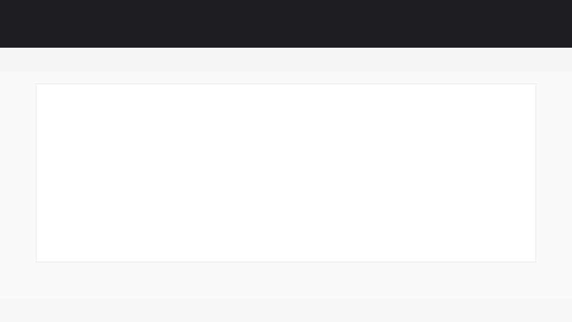

# demo-showcase

A Claude Code plugin that automatically explores your web app, captures screenshots at key states, and generates a polished HTML showcase page — all from a single slash command.

## What it does

Run `/demo-showcase` in Claude Code and the plugin will:

1. **Detect** your app's dev server (or accept a URL)
2. **Launch** a headless Playwright browser
3. **Explore** the app autonomously — finding pages, features, and interactive states
4. **Capture** 6–10 screenshots that tell a coherent story
5. **Generate** a self-contained HTML showcase page and a Markdown version with captions

All output goes into a `demo-showcase/` directory in your project. No source files are modified.

## Install

```bash
claude plugin add noamraz/demo-showcase
```

## Usage

```
/demo-showcase              # auto-detect dev server
/demo-showcase http://localhost:3000   # specific URL
```

### Output

```
your-project/
└── demo-showcase/
    ├── 01-homepage.png
    ├── 02-navigation.png
    ├── ...
    ├── demo-showcase.html    # Polished HTML showcase
    └── SHOWCASE.md           # Markdown version
```

The HTML showcase includes a hero section, stats bar, step-by-step feature walkthrough with screenshots, and a capabilities grid — ready to share or embed.

### Example

Here's what the generated HTML showcase looks like:



## Requirements

- [Claude Code](https://claude.ai/code) CLI
- Node.js (for Playwright — installed temporarily during capture)
- A running web app or a project with a dev server

## How it works

The plugin uses Playwright (installed temporarily with `--no-save`) to drive a headless Chromium browser. It navigates through your app, identifies interesting states (forms, modals, data views), and captures screenshots at 1280×800. After capture, it writes descriptions and assembles everything into a clean, responsive HTML page using a built-in template.

Playwright is automatically cleaned up after the capture completes.

## License

[MIT](LICENSE)
